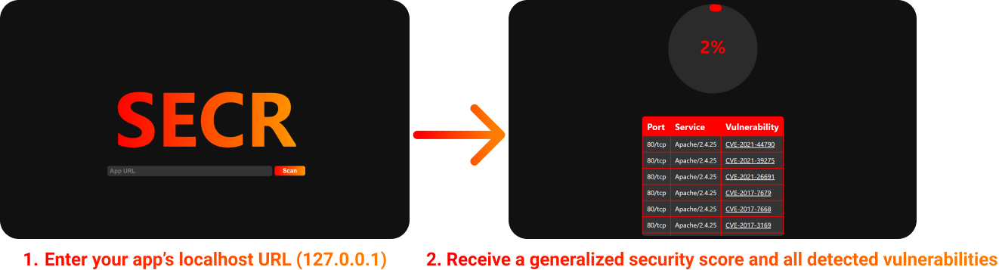

# SECR

Application security made easy.

    

## How It Works

      

## Get Started

1. `git clone https://github.com/secrdev/SECR`
2. Install nmap
3. Run Backend
   1. `cd backend/`
   2. `go run main.go`
4. Run Frontend
   1. `cd app/`
   2. `npm start`
5. Open `localhost:3000` in your browser 

## Features

### Current features:

- Vulnerability scanning using [nmap-vulners](https://github.com/vulnersCom/nmap-vulners) 
- Metadata about vulnerabilities, along with their CVE IDs, which can also be found on [Vulners](https://vulners.com/)
- Generalized security score for scanned applications 

### Planned features:

- Steps to recreate and patch each vulnerability found
- Implementing SECR in a Chrome extension and/or Github Marketplace app

## Contributing

Check out [CONTRIBUTING](CONTRIBUTING.md)